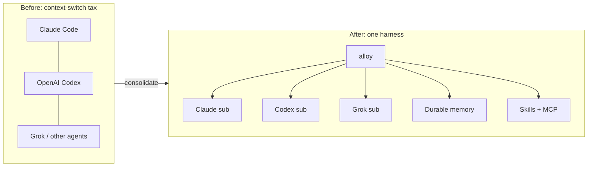
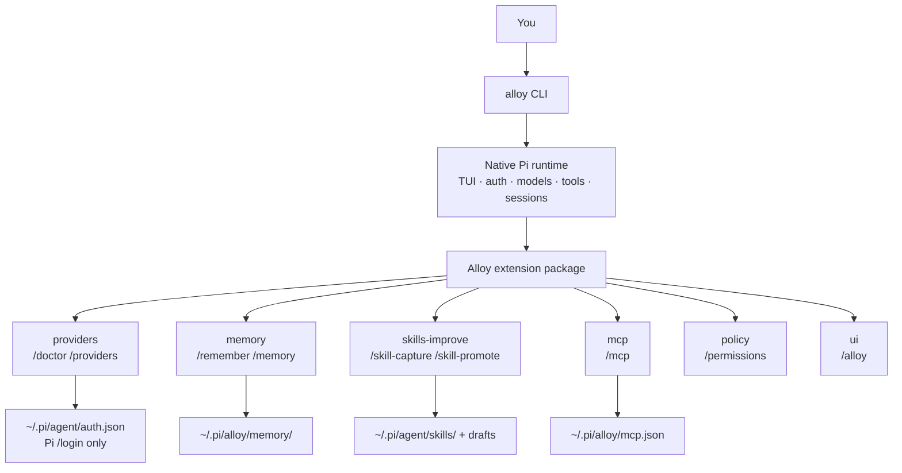
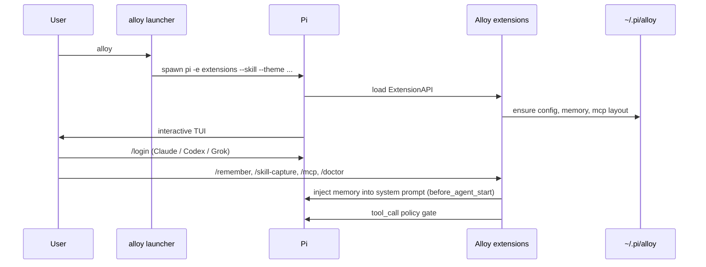
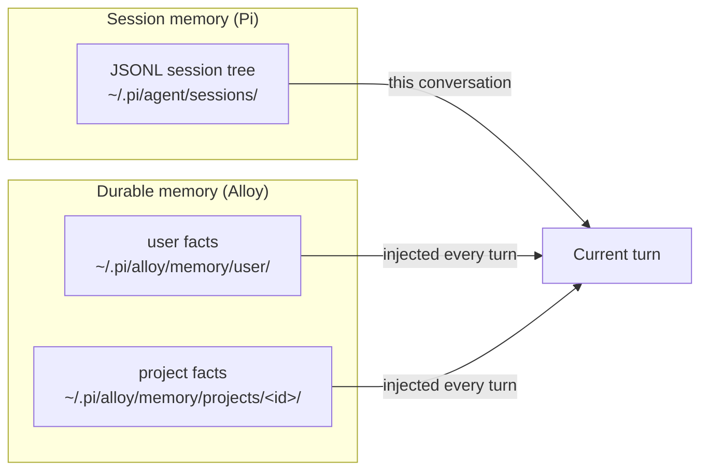
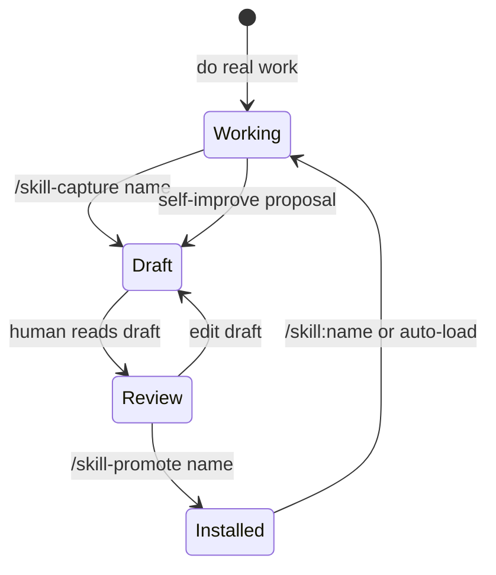
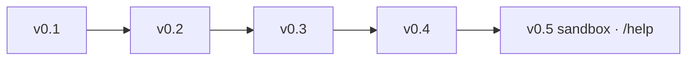
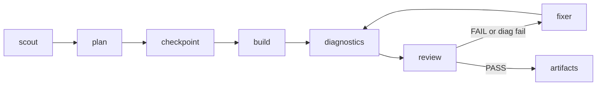
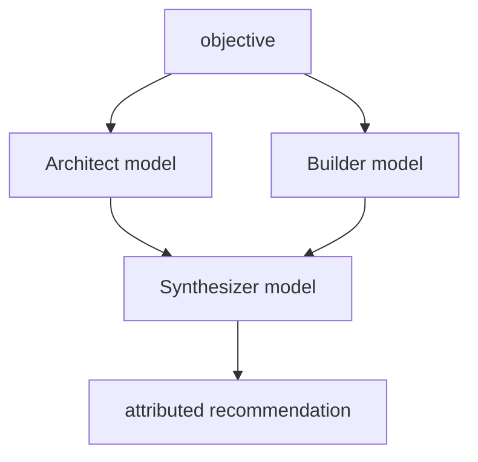

# Alloy

> **Pre-release:** Alloy is not published to npm and does not yet have a
> canonical public repository, support forum, or public vulnerability-reporting
> channel. Do not install `alloy-agent` from the npm registry. Public
> distribution remains blocked on the launch requirements in
> [docs/RELEASING.md](./docs/RELEASING.md).

**Alloy** is a multi-provider coding agent harness built on [Pi](https://pi.dev).  
One terminal command. Three subscriptions you actually use. Durable memory, skills that improve with approval, and MCP — without forking Pi or reinventing OAuth.

```bash
alloy
```

### Pre-release setup (Linux / macOS)

Requires **Node.js ≥ 22.19** (Pi engine requirement).

From a source checkout supplied by a maintainer:

```bash
npm ci
npm link
```

Release artifacts will include a shrinkwrap, and publication is configured to
require npm provenance. Avoid mutable `curl | bash` or branch-based installs.

Then:

```bash
alloy --version   # Alloy X.Y.Z · Pi · Node
alloy
```

Inside a session: `/doctor` (providers, catalog defaults, Claude extra-usage economics — never prints secrets).

### CI / verification

Release CI on Node 22.19 verifies:

- `npm ci` + full unit tests + `alloy --version`
- a clean install and real Pi startup from the packed npm artifact
- package / shrinkwrap integrity and exact executable dependencies
- catalog default model resolution
- historic secret detection, SBOM generation, and blocking high/critical audit

Local smoke:

```bash
npm run ci:local          # unit + integration + pack + security + SBOM
npm run test:integration  # MCP, packed install, Pi startup, Docker if present
```

Integration coverage:

| Suite | What it proves |
|-------|----------------|
| `mcp-fake.e2e` | Real stdio MCP process: connect, list/call tools, env scrub (no host secrets) |
| `mcp-http.e2e` | Streamable HTTP MCP: connect, list/call tools against local fixture |
| `pi-startup.e2e` | Isolated `HOME` / `PI_CODING_AGENT_DIR`: `alloy --version`, `--help`, doctor |
| `packed-install.e2e` | Actual npm tarball install: hoisted Pi discovery and native Pi startup |
| `docker-sandbox.e2e` | Live Docker: container start/reuse, bind-mount exec, `network=none` inspect |

Docker integration may skip on developer machines without Docker. Release CI
sets `ALLOY_REQUIRE_DOCKER_TEST=1` and fails if the sandbox cannot run.

| | |
|---|---|
| **Status** | MVP active development (v0.8.2) |
| **Runtime** | [Pi](https://pi.dev) / `@earendil-works/pi-coding-agent` 0.82.0 · Node **≥22.19** |
| **Planned package identity** | `alloy-agent` (not published) |
| **CLI** | `alloy` |
| **Boundary** | [docs/BOUNDARY.md](./docs/BOUNDARY.md) — what ships vs stays outside |
| **Security** | [docs/SECURITY.md](./docs/SECURITY.md) · [ATTRIBUTION](./docs/ATTRIBUTION.md) · `npm run security:scan` |
| **Operations** | [docs/OPERATIONS.md](./docs/OPERATIONS.md) — installation and safety checklist |

---

## What Alloy is

Alloy is the **product layer** on top of Pi’s minimal coding agent:

- **Pi** owns the TUI, model registry, authentication, sessions, context compaction, tools, and extension lifecycle.
- **Alloy** owns the product: subscription-focused first-run, durable memory across sessions, skill capture/promote, MCP config, and safe-by-default policy.

We do **not** fork Pi. We do **not** reimplement provider OAuth. We ship a thin `alloy` executable that launches native Pi with the Alloy package injected.

> **Name:** multi-model and multi-skill work is *alloyed* into one stronger daily harness — not a pile of disconnected tools.

---

## What it tries to replace

Day-to-day, Alloy aims to be the single terminal agent you open instead of juggling several product CLIs.



| You might use today | Alloy’s stance |
|---|---|
| **Claude Code** | Same subscription path; Alloy is provider-neutral and Pi-native |
| **OpenAI Codex CLI / ChatGPT coding agent** | Codex subscription via Pi `/login` |
| **Grok / xAI coding flows** | Grok subscription via `/login xai` |
| **Bare Pi** | Alloy is Pi with a product layer (memory, skills workflow, MCP, policy, doctor) |
| **Heavy multi-agent IDEs** | Not yet — MVP is the *daily* harness, not a swarm factory |

Alloy is **not** trying to replace your editor, GitLab, or CI. It replaces the **agent shell** you live in while coding.

---

## MVP scope (first go-round)

### In

| Pillar | Behavior |
|---|---|
| **Subscriptions** | Claude (Anthropic), Codex/ChatGPT (OpenAI), Grok (xAI) via Pi `/login` |
| **Durable memory** | Facts survive `/new` and new days (`/remember`, `/memory`) |
| **Skills** | Create, compose (skills using skills), capture + promote with approval |
| **MCP** | Config + live **stdio / HTTP / SSE** (`/mcp connect`) — tools registered on the agent |
| **Modes** | `chat` · `plan` · `build` · `review` with tool gating |
| **Checkpoints** | `/checkpoint` · `/undo` for recoverable git snapshots |
| **Worktrees** | Isolated builder trees under `~/.pi/alloy/worktrees/` |
| **Diagnostics** | `/diagnose` + `alloy_diagnostics` (typecheck/lint/test) |
| **Auto** | `/auto` with **fix loops** on review FAIL / bad diagnostics |
| **Fusion** | `/fusion <objective>` - read-only Architect + Builder proposals with attributed synthesis; `/fusion setup` configures each role |
| **Sub-agents** | `/agent` free-form multi-model agents · `/agents` browser · `alloy_task` |
| **Profiles** | research=Grok · code=Codex · review=Opus · plan=Sonnet (configurable) |
| **Agent panel** | Live widget below the editor during agents / auto / fusion |
| **Docker sandbox** | `/permissions sandbox` — bash in `node:22-bookworm`, **network none** |
| **Help** | `/help`, `/help <topic>`, `/help search <query>` |
| **Base harness** | Everything Pi already does well: TUI, tools, sessions, tree, compact, `@files`, AGENTS.md |
| **Safety** | Ask-levels (`ask-all`…`ask-none`, default `ask-dangerous`) + optional Docker sandbox; plan/review hard read-only |

### Out (for now)

- Micro-VM sandbox product (beyond Docker)
- Every OpenRouter model and a provider marketplace
- GUI / hosted control plane
- Native descriptor-relative `openat` checkpoint helper

---

## How it works



### Runtime boundaries



---

## Quick start

### Prerequisites

- **Node.js ≥ 22.19** (Pi engine requirement)
- Network access for model providers
- npm

### Pre-release source setup (Linux / macOS)

From the source checkout provided to an authorized tester:

```bash
npm ci
npm link
```

Then:

```bash
alloy
```

The canonical clone URL will be added at public launch. Until then, run
`npm run ci:local` only from a source checkout supplied for review.

### First run

```bash
cd your-project
alloy
```

Inside the TUI:

```text
/login                 # Claude Pro/Max and/or ChatGPT Codex subscription
/login xai             # Grok → "Use a subscription"
/doctor                # green/red for the three providers (never prints secrets)
/model                 # pick a connected model
/remember project uses pnpm
```

API keys work for the matching API provider routes (`ANTHROPIC_API_KEY`,
`OPENAI_API_KEY` for `openai/...`, and `XAI_API_KEY`). The `openai-codex/...`
route uses ChatGPT subscription auth from Pi `/login`. The **MVP target is subscriptions**.

---

## Commands

### Alloy-added

| Command | Purpose |
|---|---|
| `/alloy` | Help + version |
| `/doctor` | Provider + path diagnostics |
| `/providers` | Quick status for Claude · Codex · Grok |
| `/remember [user:] <fact>` | Save durable memory (project default, or `user:`) |
| `/memory list` | Browse durable memory |
| `/memory search <q>` | Search memory |
| `/memory forget <id>` | Delete a memory entry |
| `/skill-capture <name> [desc]` | Draft a skill from a workflow |
| `/skill-promote <name>` | **Approve** and install draft → `~/.pi/agent/skills/<name>/` |
| `/skill-drafts` | List drafts awaiting approval |
| `/mcp connect\|list\|status\|disconnect\|reload\|path` | MCP live bridge |
| `/mode [chat\|plan\|build\|review]` | Operating mode |
| `/plan` `/build` `/review` | Mode shortcuts |
| `/checkpoint [label]` | Create git checkpoint |
| `/checkpoints` | List checkpoints |
| `/undo [id]` | Restore checkpoint (confirms) |
| `/worktree create\|list\|remove\|diff` | Isolated git worktrees |
| `/diagnose` | Run project diagnostics |
| `/agent [bg] <name> [profile=\|model=] <task>` | Spawn multi-model sub-agent |
| `/agents` / `/agents view <id>` | List / view sub-agent transcripts |
| **Ctrl+Shift+A** | Open last sub-agent transcript |
| Live panel ticker | Streaming tool lines while agents run |
| `/profiles` | Multi-model profile map |
| `/auto <request>` | Multi-agent pipeline + fix loops |
| `/fusion <objective>` | Plan-only Architect-Builder fusion |
| `/fusion setup` / `/fusion status` / `/fusion help` | Configure, inspect, and explain Fusion role models and effort |
| `/fission [1..5] <contract>` | Trusted-repository, read-only, adjudicated review of the current Git changes |
| `alloy_fission` | Programmatic Fission tool with `request` and optional `reviewers` |
| `/panel` | Clear agent panel widget |
| `/runs` | Show runs artifact directory |
| **`Shift+Tab`** | Cycle primary operating mode: Build ↔ Plan |
| `/permissions [ask-all\|ask-some\|ask-dangerous\|ask-none\|sandbox]` | Set permission level |
| `/effort [off\|…\|max]` | Thinking / reasoning effort |
| `/sandbox [status\|start\|stop\|doctor]` | Docker sandbox controls |
| `/help [topic\|search <q>]` | Feature help + search |
| `/help commands` | Complete active slash-command registry with descriptions |

### Still Pi (unchanged)

`/login` · `/logout` · `/model` · `/settings` · `/resume` · `/new` · `/tree` · `/fork` · `/clone` · `/compact` · `/export` · `/reload` · `/quit`

Prompt templates shipped with Alloy: `/plan`, `/review`.

---

## Durable memory

Pi already persists **session trees** (resume, branch, compact). Alloy adds **durable memory** that survives a brand-new session.



- `/remember` or tool `alloy_remember` writes a fact
- On each agent turn, Alloy injects a bounded memory block into the system prompt
- **Never** store API keys or secrets in memory

---

## Honesty (anti-hallucination)

Alloy injects a **mandatory honesty policy** every turn (and into child agents):

- No fabrication of facts, files, command output, or model identity
- No confident guessing — if unsure, say so and look it up with tools
- Model identity is **harness-only** (`provider` + `id` from Pi). Never invent Composer/Cursor/etc.
- Codebase claims need tool evidence when accuracy matters

| Command | Purpose |
|---|---|
| `/whoami` | Authoritative Alloy version + active model (trust this over chat self-description) |
| `/honesty` | Show the full policy text |

Disable only if you must: `"honesty": { "enabled": false }` in `~/.pi/alloy/config.json`.

---

## Skills and self-improve



| Rule | Detail |
|---|---|
| **Create** | `/skill-capture` writes `~/.pi/alloy/skills-drafts/<name>.md` |
| **Approve** | `/skill-promote` is the only write into user skills |
| **Compose** | Skills may load other skills; max depth 3 (documented in skill-capture skill) |
| **No silent mutation** | Self-improve is always propose → approve → promote |

Starter skills in the package: `testing`, `git-hygiene`, `skill-capture`.

---

## MCP

Pi core does **not** ship MCP. Alloy owns MCP as a product concern.

- Global config: `~/.pi/alloy/mcp.json`
- Project config: `.pi/alloy-mcp.json` (trusted projects only for project entries)
- Transports: **stdio**, **http** (Streamable HTTP), **sse** (legacy)
- `/mcp connect` connects enabled servers via `@modelcontextprotocol/sdk`
- Tools appear as `mcp_<server>_<tool>` and go through Alloy policy
- Headers support `${ENV}` expansion (keep tokens out of the file)
- Optional `mcp.connectOnStart` in `~/.pi/alloy/config.json` (global servers only)

Examples (see `config/mcp.example.json`):

```json
{
  "version": 1,
  "servers": {
    "reviewed-local-server": {
      "transport": "stdio",
      "command": "/absolute/path/to/reviewed-mcp-server",
      "args": [],
      "enabled": false
    },
    "remote-mcp": {
      "transport": "http",
      "url": "https://your-host.example/mcp",
      "headers": {
        "Authorization": "Bearer ${MCP_HTTP_TOKEN}"
      },
      "enabled": false
    }
  }
}
```

```text
install -m 600 /dev/null ~/.pi/alloy/env
printf '%s\n' 'MCP_HTTP_TOKEN=replace-me' >> ~/.pi/alloy/env
/mcp connect
/mcp list
```

---

## Permission profiles

| Profile | Behavior |
|---|---|
| `ask-all` | Approve almost everything non-read |
| `ask-some` | Approve writes, process, child agents, MCP side-effects |
| `ask-dangerous` (default) | Approve dangerous bash / destructive git |
| `ask-none` | No prompts (headless-friendly) |
| `sandbox` | Docker isolation for bash (approval defaults to ask-dangerous) |

Approval profiles are independent from Build/Plan mode. Use `/permissions cycle`
or select a profile directly. Legacy ids `safe` / `workspace` / `readonly` still map.

```text
/permissions ask-dangerous
/permissions sandbox
```

---

## On-disk layout

```text
~/.pi/alloy/
  config.json              # Alloy settings
  mcp.json                 # MCP servers
  memory/user/             # cross-project facts
  memory/projects/<id>/    # per-repo facts
  skills-drafts/           # unapproved skill drafts
  runs/                    # reserved for workflow artifacts

~/.pi/agent/               # Pi home
  auth.json                # credentials (Pi-managed; mode 0600)
  sessions/                # session trees
  skills/                  # promoted skills land here
```

---

## Repository layout

```text
alloy/
├── bin/alloy.mjs              # launcher only — no agent logic
├── extensions/                # Pi ExtensionAPI modules
│   ├── index.ts
│   ├── memory.ts
│   ├── providers.ts
│   ├── skills-improve.ts
│   ├── mcp.ts
│   ├── policy.ts
│   └── ui.ts
├── lib/                       # pure Node helpers (.mjs)
├── skills/                    # package starter skills
├── prompts/                   # /plan /review templates
├── themes/alloy-dark.json
├── config/*.example.json
├── docs/
│   ├── BOUNDARY.md          # organization-neutral product line
│   ├── OPERATIONS.md        # installation and safety checklist
│   ├── MVP.md
│   ├── ARCHITECTURE.md
│   └── SECURITY.md
└── test/unit/
```

---

## Development

```bash
npm ci
npm test
npm link
alloy --help
```

### Scripts

| Script | Action |
|---|---|
| `npm test` | Unit tests (memory + provider doctor) |
| `npm link` | Install `alloy` onto your PATH |
| `alloy --no-inject ...` | Raw Pi passthrough (debug) |

### Design rules

1. Do not fork Pi.
2. Do not implement provider OAuth — use Pi `/login`.
3. Never log or artifact credential values.
4. Self-improve skills only after explicit approval.
5. MCP tools share the same policy gate as native tools.
6. Security and recovery before multi-agent autonomy.

---

## Roadmap



### Docker sandbox

```bash
/permissions sandbox     # enable (requires Docker daemon)
/sandbox status          # image, network none, container
/sandbox start|stop
```

Defaults: **image `node:22-bookworm`**, **network `none`**, project mounted at `/workspace`, 2g/2cpu, cap-drop ALL.  
`/auto` does **not** force sandbox — set the profile first (safest).

### Free-form multi-model agents

```bash
/agent scout profile=research Map the auth module
/agent coder profile=code Implement token refresh
/agent critic model=anthropic/claude-opus-4-6 Review the diff
/agents
/agents view <id>
/profiles
```

Configure models in `~/.pi/alloy/config.json` → `profiles` (Grok + Claude + Codex after each `/login`).

### Auto pipeline



### Fusion



The Architect and Builder inspect the repository concurrently with read-only
tools. Synthesis runs only after both structured proposals validate. Use
`/fusion setup` to select each role's model and requested reasoning effort, `/fusion
status` to inspect the effective settings, or configure the same values in
`~/.pi/alloy/config.json`:

```json
{
  "fusion": {
    "architectModel": "anthropic/claude-sonnet-4-6",
    "builderModel": "openai-codex/gpt-5.4",
    "synthesizerModel": "anthropic/claude-opus-4-6",
    "architectEffort": "high",
    "builderEffort": "medium",
    "synthesizerEffort": "high"
  },
  "budgets": { "maxCostUsd": 25 }
}
```

An eligible successful Fusion run performs exactly three model calls. Auth,
proposal validation, abort, or proposal-budget failures stop before synthesis.
Fusion never implements or merges code.
Pi clamps requested effort levels to each selected model's capabilities.
Each child receives only the selected provider credential in its ephemeral Pi
home, and its read tools are mechanically confined to the repository root. Run
artifacts contain proposals, synthesis, model identity, usage, and a truthful
terminal status, but never credential values.

### Fission

> **Trust boundary:** Fission is for projects the operator has marked trusted.
> Repository Git config/attributes may execute under normal Git behavior.
> Do not run it on hostile/untrusted repositories.
> This is a product boundary, not a hidden implementation caveat.

Fission freezes the current dirty Git state, sends only the bounded packet to
blind read-only reviewers, and has a fresh judge adjudicate their structured
findings. Use `/fission <contract>` for the configured default count or
`/fission 5 <contract>` for an explicit count. The equivalent `alloy_fission`
tool accepts `{ "request": "...", "reviewers": 5 }`. Counts are integers from
1 through the effective maximum of 5 and are rejected, never clamped, above
that limit.

Reviewer roles expand with the count: general adversarial at one; correctness
and security at two; architecture/failure handling at three; test/spec coverage
at four; and performance/concurrency/resources at five. Reviewer routes,
the judge route, and optional family labels are owned by the global operator
config. A five-reviewer run requires five distinct configured reviewer routes.
Fission admits each exact route with no fallback and attests the actual
provider/model emitted by every child. Authentication, transport, capacity,
concurrency, and budget must all be available for those exact routes.

Capture uses normal bounded Git commands. Review children receive only
`read`, `grep`, `find`, and `ls`, with `cwd` and `readRoot` confined to the
immutable packet root. Reviewer and judge assistant payloads have complete
serialized output limits. Reservations and observed usage live only in the
current process's in-process registry; a restart cannot resume a run. Alloy
checks source and packet digests before review, before judgment, and before the
verdict. These checks detect ordinary drift, not malicious same-UID mutation
or byte-identical ABA restoration.

`NO_CHANGES` means the repository was clean and no run was created.
`INCOMPLETE` means evidence, route admission, a child, adjudication, settlement,
or a drift check failed; it is never a pass. `FAIL` requires a judge-validated
finding at the configured blocking severity. `PASS` means only:
`no submitted blocking finding validated.` It does not mean tests ran, the code
is correct, or the change is safe to merge or deploy.

The example in [`config/alloy.example.json`](./config/alloy.example.json) uses
routes from the pinned Pi catalogs. Confirm they are authenticated in the live
catalog; five-reviewer runs need five distinct eligible reviewer routes in
addition to the judge.

#### Offline dogfood and authenticated gate

The corpus utility only prepares repositories and evaluates saved normalized
results. It does not load Alloy, credentials, or models and cannot make model
calls:

```bash
node scripts/fission-dogfood.mjs materialize \
  --fixture-root test/fixtures/fission-dogfood \
  --out /tmp/alloy-fission-dogfood
```

In a separate live authenticated Alloy session, mark each of the nine generated
repositories trusted, paste its `contract.md` into `/fission 5 <contract
contents>`, and save the run's `result.json`. Then evaluate all nine paths:

```bash
node scripts/fission-dogfood.mjs evaluate \
  --manifest test/fixtures/fission-dogfood/manifest.json \
  --case correctness-stale-cache=/path/to/result.json \
  --case correctness-partial-write=/path/to/result.json \
  --case security-path-traversal=/path/to/result.json \
  --case security-tenant-bypass=/path/to/result.json \
  --case failure-handling-reservation-leak=/path/to/result.json \
  --case failure-handling-cancellation-reported-as-success=/path/to/result.json \
  --case control-cache-invalidation=/path/to/result.json \
  --case control-contained-upload=/path/to/result.json \
  --case control-finally-settlement=/path/to/result.json
```

Missing saved paths are `UNEXECUTED`, malformed or incomplete artifacts are
`FAILED`, and only six matched high/critical seeds plus three clean controls are
`PASSED`. Integrating Fission into `/auto` is follow-up work only after this
manual authenticated dogfood gate passes.

The immediate product goal is a reliable daily harness for Claude, Codex, and
Grok users.

---

## Troubleshooting

| Symptom | What to try |
|---|---|
| `could not find the Pi CLI` | `npm i -g --ignore-scripts @earendil-works/pi-coding-agent` or set `ALLOY_PI_BIN` |
| `/doctor` shows missing providers | Run `/login` / `/login xai` for subscriptions |
| Memory not sticking after `/new` | Confirm `~/.pi/alloy/memory/` files exist; `/memory list` |
| Extension not loading | Run from a linked install; check `alloy` injects `-e` (omit `--no-inject`) |
| Dangerous command blocked | Expected under `ask-dangerous` / `ask-all`; inspect or change it with `/permissions` |
| “Update Available” for Pi after `pi update` | Alloy pins Pi in its own `node_modules` — upgrade inside the Alloy clone, not only global `pi` |
| Host mode “isolation” | Host is not a FS jail — use `/permissions sandbox` + Docker when you need container isolation |

---

## Product boundary

Alloy is a **generic** daily terminal agent harness. Company meshes, shared knowledge bases, and private skill packs integrate via **config / MCP / local skills** — they are not required features of this package. Details: [docs/BOUNDARY.md](./docs/BOUNDARY.md).

---

## License

MIT

---

## Maintainers

See [GOVERNANCE.md](./GOVERNANCE.md) for project roles and decision-making.
Contribution instructions are in [CONTRIBUTING.md](./CONTRIBUTING.md).
