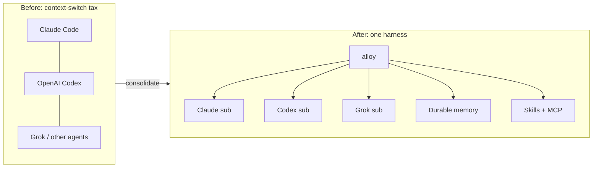
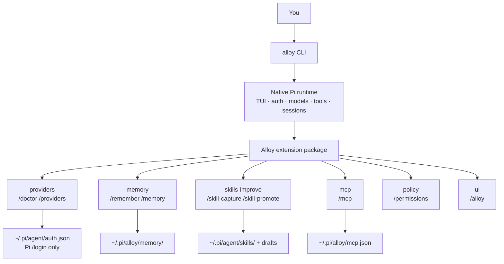
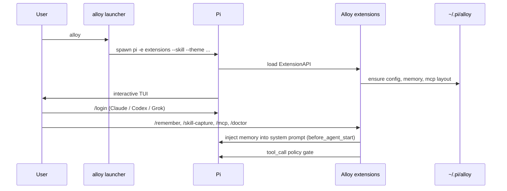
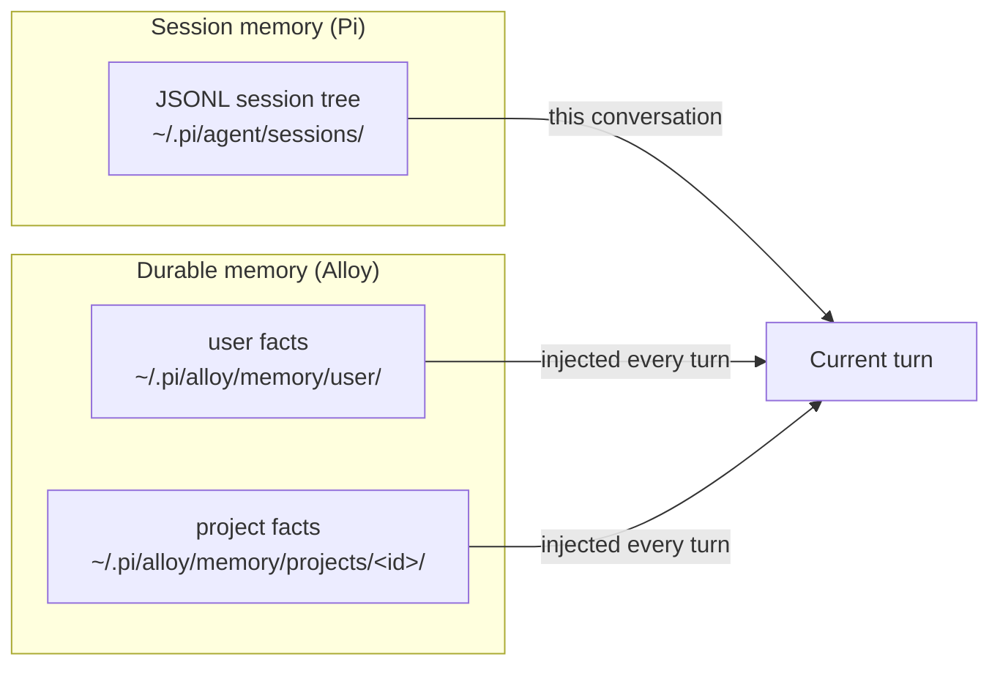
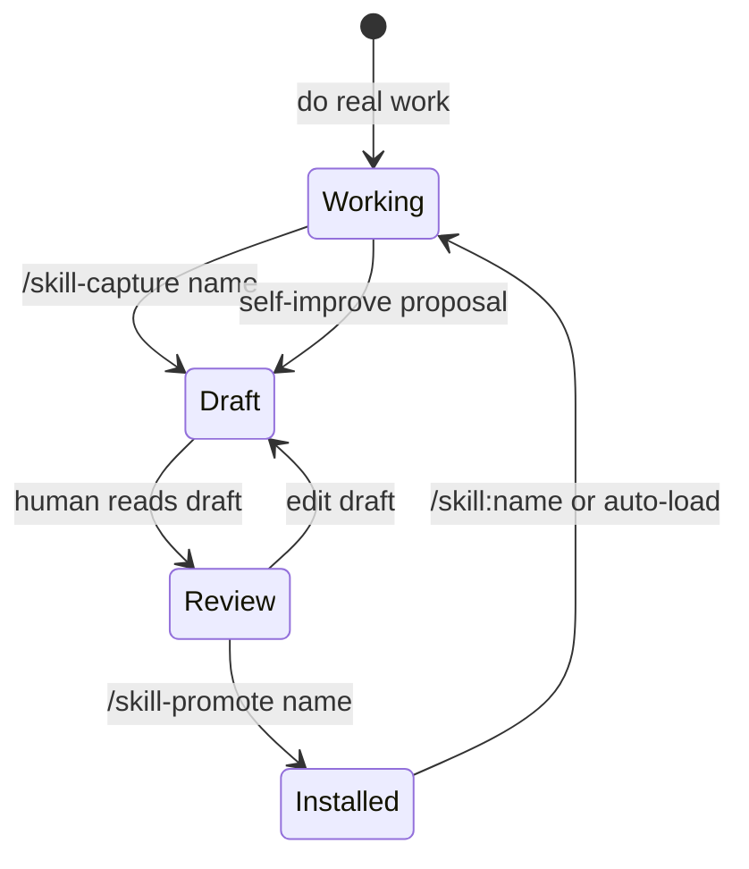
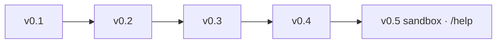
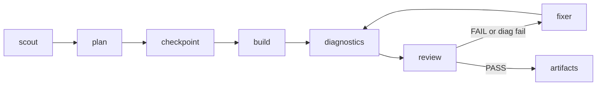
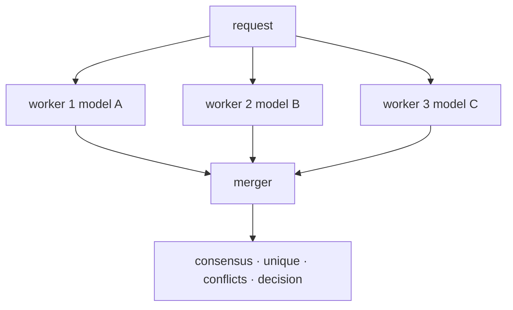

# Alloy

**Alloy** is a multi-provider coding agent harness built on [Pi](https://pi.dev).  
One terminal command. Three subscriptions you actually use. Durable memory, skills that improve with approval, and MCP — without forking Pi or reinventing OAuth.

```bash
alloy
```

### Install (Linux / macOS)

Requires **Node.js ≥ 22.19** (Pi engine requirement).

```bash
curl -fsSL https://gitlab.com/kylaira/infrastructure/alloy/-/raw/main/install.sh | bash
```

Then:

```bash
alloy --version   # Alloy X.Y.Z · Pi · Node
alloy
```

Inside a session: `/doctor` (providers, catalog defaults, Claude extra-usage economics — never prints secrets).

### CI / verification

GitLab CI (`.gitlab-ci.yml`) on Node 22.19:

- `npm ci` + full unit tests + `alloy --version`
- `npm pack --dry-run` must include `install.sh` and `scripts/install-cli.sh`
- package / lockfile version alignment
- catalog default model resolution
- `npm audit` (informational; nested Pi deps may still report high/moderate)

Local smoke:

```bash
npm run ci:local          # unit + integration + version + pack
npm run test:integration  # fake MCP, isolated startup, Docker e2e (skips if no Docker)
```

Integration coverage (Ava P1 verification):

| Suite | What it proves |
|-------|----------------|
| `mcp-fake.e2e` | Real stdio MCP process: connect, list/call tools, env scrub (no host secrets) |
| `pi-startup.e2e` | Isolated `HOME` / `PI_CODING_AGENT_DIR`: `alloy --version`, `--help`, doctor |
| `docker-sandbox.e2e` | Live Docker: container start/reuse, bind-mount exec, `network=none` inspect; **skips** if no daemon |

CI: `integration-mcp-pi` always runs; `integration-docker` uses Docker-in-Docker (`allow_failure: true` if runner has no dind).

| | |
|---|---|
| **Status** | MVP active development (v0.8.2) |
| **Runtime** | [Pi](https://pi.dev) / `@earendil-works/pi-coding-agent` ^0.80.10 · Node **≥22.19** |
| **Repo** | [kylaira/infrastructure/alloy](https://gitlab.com/kylaira/infrastructure/alloy) |
| **Package** | `@kylaira/alloy` |
| **CLI** | `alloy` |

---

## What Alloy is

Alloy is the **product layer** on top of Pi’s minimal coding agent:

- **Pi** owns the TUI, model registry, authentication, sessions, context compaction, tools, and extension lifecycle.
- **Alloy** owns the product: subscription-focused first-run, durable memory across sessions, skill capture/promote, MCP config, and safe-by-default policy.

We do **not** fork Pi. We do **not** reimplement provider OAuth. We ship a thin `alloy` executable that launches native Pi with the Alloy package injected.

> **Name:** multi-model and multi-skill work is *alloyed* into one stronger daily harness — not a pile of disconnected tools.

---

## What it tries to replace

Day-to-day, Alloy aims to be the single terminal agent you open instead of juggling several product CLIs.



| You might use today | Alloy’s stance |
|---|---|
| **Claude Code** | Same subscription path; Alloy is provider-neutral and Pi-native |
| **OpenAI Codex CLI / ChatGPT coding agent** | Codex subscription via Pi `/login` |
| **Grok / xAI coding flows** | Grok subscription via `/login xai` |
| **Bare Pi** | Alloy is Pi with a product layer (memory, skills workflow, MCP, policy, doctor) |
| **Heavy multi-agent IDEs** | Not yet — MVP is the *daily* harness, not a swarm factory |

Alloy is **not** trying to replace your editor, GitLab, or CI. It replaces the **agent shell** you live in while coding.

---

## MVP scope (first go-round)

### In

| Pillar | Behavior |
|---|---|
| **Subscriptions** | Claude (Anthropic), Codex/ChatGPT (OpenAI), Grok (xAI) via Pi `/login` |
| **Durable memory** | Facts survive `/new` and new days (`/remember`, `/memory`) |
| **Skills** | Create, compose (skills using skills), capture + promote with approval |
| **MCP** | Config + **live stdio connect** (`/mcp connect`) — tools registered on the agent |
| **Modes** | `chat` · `plan` · `build` · `review` with tool gating |
| **Checkpoints** | `/checkpoint` · `/undo` for recoverable git snapshots |
| **Worktrees** | Isolated builder trees under `~/.pi/alloy/worktrees/` |
| **Diagnostics** | `/diagnose` + `alloy_diagnostics` (typecheck/lint/test) |
| **Auto** | `/auto` with **fix loops** on review FAIL / bad diagnostics |
| **Fusion** | `/fusion [plan\|build]` — independent workers + attributed merger |
| **Sub-agents** | `/agent` free-form multi-model agents · `/agents` browser · `alloy_task` |
| **Profiles** | research=Grok · code=Codex · review=Opus · plan=Sonnet (configurable) |
| **Agent panel** | Live widget below the editor during agents / auto / fusion |
| **Docker sandbox** | `/permissions sandbox` — bash in `node:22-bookworm`, **network none** |
| **Help** | `/help`, `/help <topic>`, `/help search <query>` |
| **Base harness** | Everything Pi already does well: TUI, tools, sessions, tree, compact, `@files`, AGENTS.md |
| **Safety** | Ask-levels (`ask-all`…`ask-none`, default `ask-dangerous`) + optional Docker sandbox; plan/review hard read-only |

### Out (for now)

- Micro-VM sandbox product (beyond Docker)
- Every OpenRouter model and a provider marketplace
- GUI / hosted control plane
- Public GitHub launch packaging (fresh history, SBOM, quiet security preview) — see `docs/SECURITY.md`
- Native descriptor-relative `openat` checkpoint helper

---

## How it works



### Runtime boundaries



---

## Quick start

### Prerequisites

- **Node.js ≥ 22.19** (Pi engine requirement)
- Network access for model providers
- GitLab SSH key (for this repo)

### One-command install (Linux / macOS)

```bash
curl -fsSL https://gitlab.com/kylaira/infrastructure/alloy/-/raw/main/install.sh | bash
```

Needs **git**, **Node ≥ 22.19**, and GitLab access (SSH key recommended for private repos).

If the raw URL is private or blocked, use:

```bash
git clone git@gitlab.com:kylaira/infrastructure/alloy.git ~/dev/alloy \
  && bash ~/dev/alloy/install.sh
```

That single script will:

1. Clone or update `~/dev/alloy` (override with `ALLOY_DIR=…`)  
2. `npm install` (pulls Pi and deps)  
3. Install the `alloy` command on PATH (next to `node` + `~/.local/bin`)  
4. Patch shell rc files if needed  
5. Smoke-test `alloy --help`  

Then:

```bash
alloy
```

Optional env vars: `ALLOY_DIR`, `ALLOY_REPO`, `ALLOY_BRANCH`, `ALLOY_NODE_MIN`.

### Manual install (already cloned)

```bash
cd ~/dev/alloy
git pull
bash install.sh
# or only refresh the CLI shim:
npm run install-cli
```

### First run

```bash
cd your-project
alloy
```

Inside the TUI:

```text
/login                 # Claude Pro/Max and/or ChatGPT Codex subscription
/login xai             # Grok → "Use a subscription"
/doctor                # green/red for the three providers (never prints secrets)
/model                 # pick a connected model
/remember project uses pnpm
```

API keys still work as a fallback (`ANTHROPIC_API_KEY`, `OPENAI_API_KEY`, `XAI_API_KEY`), but the **MVP target is subscriptions**.

---

## Commands

### Alloy-added

| Command | Purpose |
|---|---|
| `/alloy` | Help + version |
| `/doctor` | Provider + path diagnostics |
| `/providers` | Quick status for Claude · Codex · Grok |
| `/remember [user:] <fact>` | Save durable memory (project default, or `user:`) |
| `/memory list` | Browse durable memory |
| `/memory search <q>` | Search memory |
| `/memory forget <id>` | Delete a memory entry |
| `/skill-capture <name> [desc]` | Draft a skill from a workflow |
| `/skill-promote <name>` | **Approve** and install draft → `~/.pi/agent/skills/<name>/` |
| `/skill-drafts` | List drafts awaiting approval |
| `/mcp connect\|list\|status\|disconnect\|reload\|path` | MCP live bridge |
| `/mode [chat\|plan\|build\|review]` | Operating mode |
| `/plan` `/build` `/review` | Mode shortcuts |
| `/checkpoint [label]` | Create git checkpoint |
| `/checkpoints` | List checkpoints |
| `/undo [id]` | Restore checkpoint (confirms) |
| `/worktree create\|list\|remove\|diff` | Isolated git worktrees |
| `/diagnose` | Run project diagnostics |
| `/agent [bg] <name> [profile=\|model=] <task>` | Spawn multi-model sub-agent |
| `/agents` / `/agents view <id>` | List / view sub-agent transcripts |
| **Ctrl+Shift+A** | Open last sub-agent transcript |
| Live panel ticker | Streaming tool lines while agents run |
| `/profiles` | Multi-model profile map |
| `/auto <request>` | Multi-agent pipeline + fix loops |
| `/fusion [plan\|build] <request>` | Multi-model fusion |
| `/panel` | Clear agent panel widget |
| `/runs` | Show runs artifact directory |
| **`Shift+Tab`** | Cycle permission ask-levels |
| `/permissions [ask-all\|ask-some\|ask-dangerous\|ask-none\|sandbox]` | Set permission level |
| `/effort [off\|…\|max]` | Thinking / reasoning effort |
| `/sandbox [status\|start\|stop\|doctor]` | Docker sandbox controls |
| `/help [topic\|search <q>]` | Feature help + search |

### Still Pi (unchanged)

`/login` · `/logout` · `/model` · `/settings` · `/resume` · `/new` · `/tree` · `/fork` · `/clone` · `/compact` · `/export` · `/reload` · `/quit`

Prompt templates shipped with Alloy: `/plan`, `/review`.

---

## Durable memory

Pi already persists **session trees** (resume, branch, compact). Alloy adds **durable memory** that survives a brand-new session.



- `/remember` or tool `alloy_remember` writes a fact
- On each agent turn, Alloy injects a bounded memory block into the system prompt
- **Never** store API keys or secrets in memory

---

## Honesty (anti-hallucination)

Alloy injects a **mandatory honesty policy** every turn (and into child agents):

- No fabrication of facts, files, command output, or model identity
- No confident guessing — if unsure, say so and look it up with tools
- Model identity is **harness-only** (`provider` + `id` from Pi). Never invent Composer/Cursor/etc.
- Codebase claims need tool evidence when accuracy matters

| Command | Purpose |
|---|---|
| `/whoami` | Authoritative Alloy version + active model (trust this over chat self-description) |
| `/honesty` | Show the full policy text |

Disable only if you must: `"honesty": { "enabled": false }` in `~/.pi/alloy/config.json`.

---

## Skills and self-improve



| Rule | Detail |
|---|---|
| **Create** | `/skill-capture` writes `~/.pi/alloy/skills-drafts/<name>.md` |
| **Approve** | `/skill-promote` is the only write into user skills |
| **Compose** | Skills may load other skills; max depth 3 (documented in skill-capture skill) |
| **No silent mutation** | Self-improve is always propose → approve → promote |

Starter skills in the package: `testing`, `git-hygiene`, `skill-capture`.

---

## MCP

Pi core does **not** ship MCP. Alloy owns MCP as a product concern.

**Now (v0.2):**

- Global config: `~/.pi/alloy/mcp.json`
- Project config: `.pi/alloy-mcp.json`
- `/mcp connect` spawns stdio servers via `@modelcontextprotocol/sdk`
- Tools appear as `mcp_<server>_<tool>` and go through Alloy policy
- `/mcp disconnect` tears down processes
- Optional `mcp.connectOnStart` in `~/.pi/alloy/config.json`

Example config (see `config/mcp.example.json`):

```json
{
  "version": 1,
  "servers": {
    "everything": {
      "command": "npx",
      "args": ["-y", "@modelcontextprotocol/server-everything"],
      "enabled": true,
      "transport": "stdio"
    }
  }
}
```

```text
/mcp connect
/mcp list
```

---

## Permission profiles

| Profile | Behavior |
|---|---|
| `readonly` | Blocks write/edit and non-inspection bash |
| `safe` (default) | Normal work; dangerous bash asks approval (fail-closed headless) |
| `workspace` | Full host autonomy in the project (still no secret printing) |

```text
/permissions safe
```

---

## On-disk layout

```text
~/.pi/alloy/
  config.json              # Alloy settings
  mcp.json                 # MCP servers
  memory/user/             # cross-project facts
  memory/projects/<id>/    # per-repo facts
  skills-drafts/           # unapproved skill drafts
  runs/                    # reserved for workflow artifacts

~/.pi/agent/               # Pi home
  auth.json                # credentials (Pi-managed; mode 0600)
  sessions/                # session trees
  skills/                  # promoted skills land here
```

---

## Repository layout

```text
alloy/
├── bin/alloy.mjs              # launcher only — no agent logic
├── extensions/                # Pi ExtensionAPI modules
│   ├── index.ts
│   ├── memory.ts
│   ├── providers.ts
│   ├── skills-improve.ts
│   ├── mcp.ts
│   ├── policy.ts
│   └── ui.ts
├── lib/                       # pure Node helpers (.mjs)
├── skills/                    # package starter skills
├── prompts/                   # /plan /review templates
├── themes/alloy-dark.json
├── config/*.example.json
├── docs/
│   ├── MVP.md
│   └── ARCHITECTURE.md
└── test/unit/
```

---

## Development

```bash
git clone git@gitlab.com:kylaira/infrastructure/alloy.git
cd alloy
npm install
npm test
npm link
alloy --help
```

### Scripts

| Script | Action |
|---|---|
| `npm test` | Unit tests (memory + provider doctor) |
| `npm link` | Install `alloy` onto your PATH |
| `alloy --no-inject ...` | Raw Pi passthrough (debug) |

### Design rules

1. Do not fork Pi.
2. Do not implement provider OAuth — use Pi `/login`.
3. Never log or artifact credential values.
4. Self-improve skills only after explicit approval.
5. MCP tools must share native policy when the bridge lands.
6. Security and recovery before multi-agent autonomy.

---

## Roadmap



### Docker sandbox

```bash
/permissions sandbox     # enable (requires Docker daemon)
/sandbox status          # image, network none, container
/sandbox start|stop
```

Defaults: **image `node:22-bookworm`**, **network `none`**, project mounted at `/workspace`, 2g/2cpu, cap-drop ALL.  
`/auto` does **not** force sandbox — set the profile first (safest).

### Free-form multi-model agents

```bash
/agent scout profile=research Map the auth module
/agent coder profile=code Implement token refresh
/agent critic model=anthropic/claude-opus-4-6 Review the diff
/agents
/agents view <id>
/profiles
```

Configure models in `~/.pi/alloy/config.json` → `profiles` (Grok + Claude + Codex after each `/login`).

### Auto pipeline



### Fusion



Configure workers in `~/.pi/alloy/config.json`:

```json
{
  "fusion": {
    "models": [
      "anthropic/claude-sonnet-4-5",
      "openai-codex/gpt-5.1",
      "xai/grok-3"
    ],
    "mergerModel": "anthropic/claude-sonnet-4-5"
  },
  "budgets": { "maxFixRounds": 2 }
}
```

The longer architect plan (independent reviewer, fusion, sandbox profiles, acceptance contracts) remains valid as **post-MVP** product work. This repo’s job first is: **something Chris can use every day on Claude, Codex, and Grok.**

---

## Troubleshooting

| Symptom | What to try |
|---|---|
| `could not find the Pi CLI` | `npm i -g --ignore-scripts @earendil-works/pi-coding-agent` or set `ALLOY_PI_BIN` |
| `/doctor` shows missing providers | Run `/login` / `/login xai` for subscriptions |
| Memory not sticking after `/new` | Confirm `~/.pi/alloy/memory/` files exist; `/memory list` |
| Extension not loading | Run from a linked install; check `alloy` injects `-e` (omit `--no-inject`) |
| Dangerous command blocked | Expected under `safe`; `/permissions workspace` only if you mean it |

---

## Related Kylaira context

Alloy is infrastructure for the Kylaira agent stack (Pi-based coding harness). It sits alongside products like KylairaOS, Conclave, and Sphere — those coordinate businesses and multi-agent orgs; **Alloy is the engineer’s daily terminal agent.**

---

## License

MIT

---

## Maintainers

Kylaira · Founder: Chris Coussa
