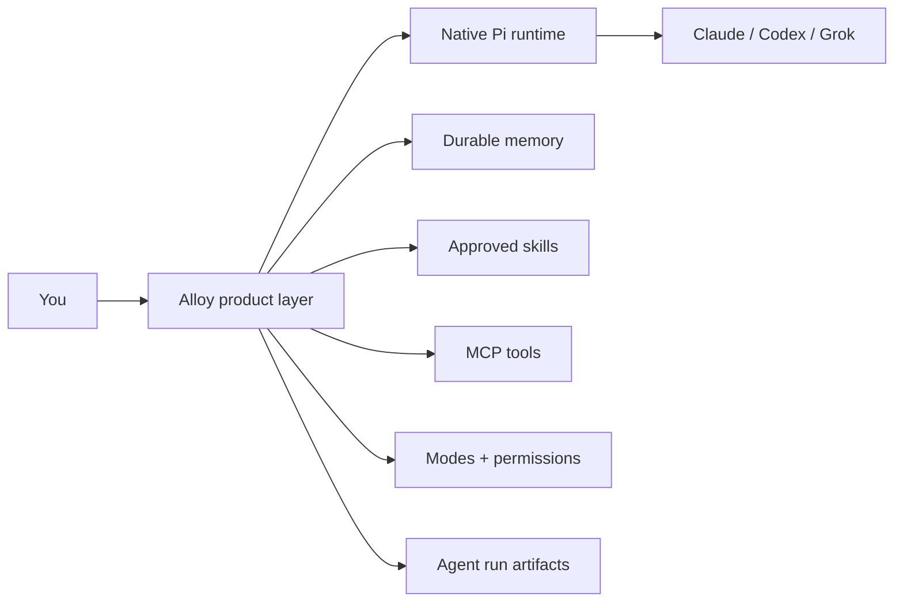

<p align="center">
  <picture>
    <source srcset="docs/assets/alloy-wordmark-dark.svg" media="(prefers-color-scheme: dark)">
    <source srcset="docs/assets/alloy-wordmark-light.svg" media="(prefers-color-scheme: light)">
    
  </picture>
</p>

<p align="center"><strong>One terminal. Your best models, working as a system.</strong></p>

<p align="center">
  <a href="https://github.com/ccoussa717/alloy/actions/workflows/ci.yml"></a>
  
  
  <a href="LICENSE"></a>
</p>

<p align="center">
  <a href="#quick-start">Quick start</a> &middot;
  <a href="#three-ways-to-work">Workflows</a> &middot;
  <a href="#safety-that-travels-with-the-work">Safety</a> &middot;
  <a href="docs/REFERENCE.md">Reference</a> &middot;
  <a href="docs/ARCHITECTURE.md">Architecture</a>
</p>

Alloy is a multi-provider coding agent harness built on
[Pi](https://pi.dev). It brings Claude, ChatGPT/Codex, and Grok into one daily
terminal with durable memory, reusable skills, MCP, bounded multi-agent
workflows, and one mechanical policy boundary.

It does not fork Pi or reimplement provider authentication. Alloy keeps Pi's
native TUI, tools, sessions, model registry, and `/login`, then adds the product
layer around them.

<p align="center">
  
</p>

> [!IMPORTANT]
> Alloy is pre-release source. The `alloy-agent` package is not published to
> npm; do not install that registry name. Use the source setup below.

## Quick start

**Requires:** macOS or Linux with `curl` and `tar`. Automatic Node bootstrap
also requires `sha256sum` or `shasum`. The installer reuses an existing Node.js
22.19+ runtime on any architecture. Bootstrap supports macOS x64/arm64 and
glibc Linux x64/arm64/armv7.

```bash
curl -fsSL https://raw.githubusercontent.com/ccoussa717/alloy/main/install.sh | bash

# Restart your shell, then:
alloy
```

The installer writes only to your user directories, needs no `sudo`, and
installs Alloy, its bundled Pi runtime, and pinned npm dependencies under
`~/.local`. Writable, regular Bash and Zsh startup files are updated
automatically. For another shell or symlinked dotfiles, add `~/.local/bin` to
`PATH` or run `~/.local/bin/alloy` directly. The convenience command resolves
`main` once and installs that exact commit. To pin both the installer and source
snapshot, use the same full commit SHA in both places:

```bash
curl -fsSL https://raw.githubusercontent.com/ccoussa717/alloy/<full-commit-sha>/install.sh \
  | ALLOY_REF=<full-commit-sha> bash
```

Contributors should install from a clone instead:

```bash
git clone https://github.com/ccoussa717/alloy.git
cd alloy && npm ci && npm link
```

```bash
cd /path/to/your-project
alloy
```

On first run, connect only the providers you intend to use:

```text
/login                 # Claude and ChatGPT/Codex subscription routes
/login xai             # Grok subscription route
/doctor                # provider, model, and path checks; never secret values
/model                 # choose the active model
```

Then work in native chat or choose a workflow:

```text
/remember this project uses pnpm
/fusion Plan a safe authentication refactor
/auto Add the approved health-check endpoint
```

See the [complete command and configuration reference](docs/REFERENCE.md) for
provider routing, permission profiles, MCP, paths, and troubleshooting.

## Why Alloy

| One shell | Context that compounds | Orchestration with boundaries |
|---|---|---|
| Switch among connected Claude, Codex, and Grok routes without rebuilding your workspace. | Project and user facts survive `/new`, new sessions, and new days. Approved skills become reusable operating knowledge. | Direct chat uses the active policy; child workflows add credential isolation, budget ceilings, and inherited policy limits. |

Most coding agents make you choose a model and rebuild context around it. Alloy
separates the **harness** from the **model**: use one model directly, route a task
by role, or combine independent proposals without changing terminals.

## Three ways to work

<p align="center">
  
</p>

| Workflow | Use it when | What Alloy does |
|---|---|---|
| **Chat** | You want a fast answer or direct implementation from the active model. | Runs the native Pi loop with Alloy memory, skills, MCP, policy, and UI. |
| **Fusion** | The decision benefits from two independent technical perspectives. | Runs read-only Architect and Builder proposals concurrently, then gives a fresh Synthesizer both validated outputs. |
| **Auto** | The work has an accepted implementation boundary and should be checked as it progresses. | Runs Scout, Planner, Builder, diagnostics, independent review, and bounded fix rounds with artifacts. |

### Fusion: combine perspectives, keep provenance

`/fusion <objective>` is a plan-only coordinator. Architect and Builder inspect
the same repository independently with repository-confined read tools. A
Synthesizer runs only after both proposal contracts validate and returns one
attributed recommendation.

An eligible successful run launches exactly three routed child-agent roles.
Each role may take multiple model turns while using read tools. Auth, abort,
validation, or budget failures stop earlier. Fusion never writes or merges
project code.

### Auto: build, check, review, repeat

`/auto <request>` attempts a checkpoint in Git repositories, prefers an isolated
worktree, delegates bounded roles, runs project diagnostics, and asks an
independent Reviewer for a verdict. A checkpoint failure is recorded but does
not stop the build. Diagnostic or review failures can trigger a limited Fixer
loop.

Every run records routing and usage metadata, raw check output, patches, and
status under `~/.pi/alloy/runs/`. Treat these artifacts as operator data because
repository diagnostics control what they print. Auto fails closed when Docker
sandbox isolation is required because its diagnostics execute as host processes.

## The product layer on Pi

| Alloy adds | What that means day to day |
|---|---|
| **Provider-aware first run** | `/doctor`, `/providers`, and honest distinction between subscription and API-key routes. |
| **Durable memory** | `/remember` and `/memory` keep bounded user and project facts across sessions. |
| **Skills with promotion** | Capture a workflow as a draft; only `/skill-promote` installs it into user skills. |
| **Live MCP** | Connect reviewed stdio, Streamable HTTP, or SSE servers; MCP tools use the same capability gate. |
| **Modes and permissions** | Build and Plan are separate from approval profiles, so model tool calls in read-only work stay mechanically read-only. |
| **Recovery tools** | Authenticated Git checkpoints and isolated worktrees make agent changes easier to inspect and undo. |
| **Multi-model agents** | `/agent`, `/fusion`, and `/auto` route roles without copying the host's complete credential store. |
| **Searchable help** | `/help`, `/help <topic>`, and `/help commands` describe the active harness from inside the TUI. |



Pi owns the interactive runtime, model catalog, authentication, sessions,
compaction, native tools, and extension lifecycle. Alloy owns the durable
workflow and safety layer. The full boundary is documented in
[Architecture](docs/ARCHITECTURE.md) and [Product boundary](docs/BOUNDARY.md).

## Safety that travels with the work

Alloy treats safety as state enforced by code, not a sentence in a prompt.

| Control | Enforcement |
|---|---|
| **Plan and Review** | Model tool calls are hard read-only: no bash, edits, writes, or mutating MCP calls. Operator-invoked slash commands remain an explicit control plane. |
| **Default approvals** | `ask-dangerous` prompts for known dangerous shell patterns, destructive Git, MCP, and tools classified as network or external actions. |
| **Child policy ceiling** | Child manifests constrain approval profile, sandbox requirement, tools, budget, and concurrency. Model child-tool calls are denied in read-only modes; operator-invoked Auto explicitly launches Build roles and confirms first when interactive. |
| **Credential boundary** | Child environments are allowlisted; Fusion leases only the selected provider credential into an ephemeral home. |
| **Project trust** | Project config cannot weaken the operator approval profile, global sandbox controls, MCP enablement, or budget ceilings. |
| **Docker Bash sandbox** | Optional `network=none` container with dropped Linux capabilities and a mounted workspace; fails closed if required but unavailable. |
| **Diagnostics disclosure** | Repository-defined host commands have a scrubbed environment and require approval when model-triggered; they are not a filesystem sandbox. |

Trusted projects may still choose their default mode, model profiles including
tool lists and system prompts, and whether Auto uses a worktree. Host mode is
not filesystem or network isolation:
ordinary Bash egress is not an `ask-dangerous` trigger, and MCP servers and
repository diagnostics are host processes. Read the
[security model](docs/SECURITY.md) before using Alloy on untrusted code.

## Commands worth knowing

| Command | Purpose |
|---|---|
| `/doctor` | Check providers, models, versions, and paths without printing secrets. |
| `/remember <fact>` | Save a durable project fact; prefix with `user:` for cross-project memory. |
| `/mode plan` / `/mode build` | Switch between mechanical read-only and implementation modes. |
| `/permissions` | Select approval behavior or the Docker Bash sandbox profile. |
| `/checkpoint` / `/undo` | Capture and restore a recoverable Git snapshot. |
| `/agent` / `/agents` | Launch and inspect a free-form routed child agent. |
| `/fusion <objective>` | Produce two independent read-only proposals and attributed synthesis. |
| `/auto <request>` | Run the bounded build, diagnostics, review, and fix workflow. |
| `/mcp` | Connect, list, reload, and inspect configured MCP servers. |
| `/help commands` | Show the complete active Pi and Alloy command registry. |

The [reference guide](docs/REFERENCE.md) includes every Alloy command, provider
routes, permission profiles, configuration examples, filesystem layout, and
troubleshooting.

## Project status

Alloy is an active `0.x` pre-release. The source currently targets Pi 0.82.0
and Node.js 22.19 or newer. npm publication remains disabled until the release
gates in [RELEASING.md](docs/RELEASING.md) are complete.

GitHub Actions runs the unit and integration suites, installs the packed npm
artifact in isolation, requires the Docker sandbox test, validates package and
shrinkwrap integrity, scans the complete public history for secret signatures,
audits dependencies, and uploads a CycloneDX SBOM.

Local verification:

```bash
npm run ci:local
```

## Documentation

| Document | Read it for |
|---|---|
| [Reference](docs/REFERENCE.md) | Commands, configuration, provider routes, paths, and troubleshooting. |
| [MVP contract](docs/MVP.md) | Implemented scope and explicit exclusions. |
| [Architecture](docs/ARCHITECTURE.md) | Runtime layers, trust boundaries, child execution, checkpoints, and worktrees. |
| [Security](docs/SECURITY.md) | Threat model, credential handling, sandbox claims, supply chain, and residual risks. |
| [Operations](docs/OPERATIONS.md) | Installation and daily-use safety checklist. |
| [Product boundary](docs/BOUNDARY.md) | What belongs in the generic package and what stays outside it. |
| [Attribution](docs/ATTRIBUTION.md) | Pi and third-party provenance. |
| [Releasing](docs/RELEASING.md) | Maintainer-only release and publication gates. |

## Acknowledgments

Alloy stands on and draws inspiration from excellent open-source work:

- [Pi](https://github.com/earendil-works/pi) is the coding-agent runtime beneath
  Alloy, providing the native TUI, model registry, authentication, sessions,
  tools, and extension system.
- [OpenCode](https://github.com/anomalyco/opencode) inspired the standard of a
  focused, terminal-first developer experience and clear product presentation.
- [Fusion Harness](https://github.com/disler/fusion-harness) inspired parts of
  Alloy's multi-model role framing and the way independent perspectives are
  brought together for synthesis.

See [Attribution](docs/ATTRIBUTION.md) for the dependency and provenance details.

## Contributing

Alloy is MIT licensed. Start with [CONTRIBUTING.md](CONTRIBUTING.md), add a
failing test for behavior changes, and run `npm run ci:local` before opening a
pull request. Security reports belong in the private process described in
[SECURITY.md](SECURITY.md), not a public issue.

Maintainer: [Chris Coussa](https://github.com/ccoussa717)
