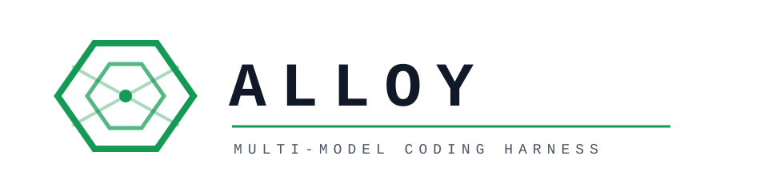
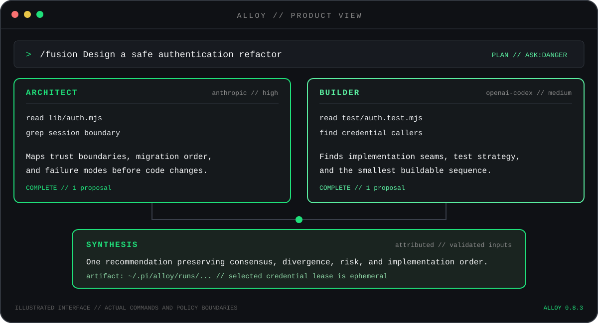
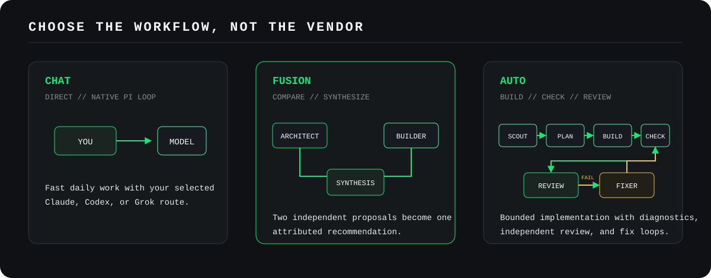
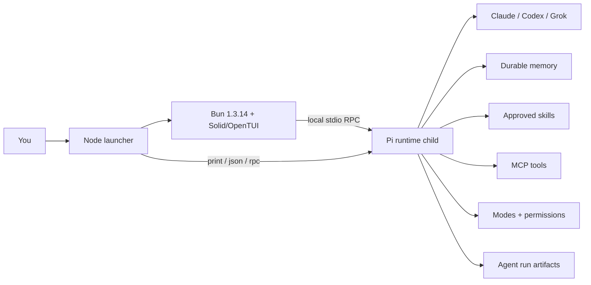

<p align="center">
  <picture>
    <source srcset="docs/assets/alloy-wordmark-dark.svg" media="(prefers-color-scheme: dark)">
    <source srcset="docs/assets/alloy-wordmark-light.svg" media="(prefers-color-scheme: light)">
    
  </picture>
</p>

<p align="center"><strong>One terminal. Your best models, working as a system.</strong></p>

<p align="center">
  <a href="https://github.com/ccoussa717/alloy/actions/workflows/ci.yml"></a>
  
  
  <a href="LICENSE"></a>
</p>

## Table of contents

- [Quick start](#quick-start)
- [How Alloy works (3 layers)](#how-alloy-works-3-layers)
- [In-product help](#in-product-help)
- [What you see while it works](#what-you-see-while-it-works)
- [Workflows](#workflows)
  - [Comparison](#comparison)
  - [Setup once](#setup-once)
  - [Combinations](#combinations)
  - [Chat (default path)](#chat-default-path)
  - [Free-form sub-agents](#free-form-sub-agents)
  - [Fusion](#fusion-combine-perspectives-keep-provenance)
  - [Fission](#fission-adjudicate-the-current-change)
  - [Auto](#auto-build-check-review-repeat)
  - [Forge](#forge-full-multi-model-spine)
  - [CLI and CI](#cli-and-ci)
- [The product layer on Pi](#the-product-layer-on-pi)
- [Safety that travels with the work](#safety-that-travels-with-the-work)
- [Commands worth knowing](#commands-worth-knowing)
- [Project status](#project-status)
- [Documentation](#documentation)
- [Acknowledgments](#acknowledgments)
- [Contributing](#contributing)

Also: [Reference](docs/REFERENCE.md) · [Architecture](docs/ARCHITECTURE.md) · [Security](docs/SECURITY.md)

Alloy is a multi-provider coding agent harness built on
[Pi](https://pi.dev). It brings Claude, ChatGPT/Codex, and Grok into one daily
terminal with durable memory, reusable skills, MCP, bounded multi-agent
workflows, and one mechanical policy boundary.

Interactive sessions use an Alloy shell adapted from the MIT-licensed OpenCode
1.18.4 Solid/OpenTUI architecture. The Node launcher starts the pinned Bun
1.3.14 frontend, which owns rendering and talks over local stdio RPC to a Pi
child. Pi still owns the agent runtime, provider authentication, policy, tools,
credentials, sessions, extensions, and model registry. This adaptation is not
affiliated with or endorsed by OpenCode.

<p align="center">
  
</p>

> [!IMPORTANT]
> Alloy is distributed as source via the installer (or a clone). The
> `alloy-agent` package is not published to npm; do not install that registry
> name. Use the source setup below.

## Quick start

**Requires:** macOS or glibc-based Linux x64/arm64 with `curl`, `tar`, `unzip`, and
`sha256sum` or `shasum`. The installer reuses Node.js 22.19+ when available and
otherwise installs a checksum-verified Node runtime. It always installs the
checksum-verified Bun 1.3.14 artifact selected for the host. Alpine and other
musl-based Linux distributions are not supported.

```bash
curl -fsSL https://raw.githubusercontent.com/ccoussa717/alloy/main/install.sh | bash

# Restart your shell, then:
alloy
```

The installer defaults to the **stable** channel (latest GitHub release tag).
When no release exists yet, it falls back to the tip of `main`. Pin explicitly:

```bash
# Pin to a release tag
curl -fsSL https://raw.githubusercontent.com/ccoussa717/alloy/v1.1.25/install.sh | ALLOY_REF=v1.1.25 bash

# Always install tip of main
curl -fsSL https://raw.githubusercontent.com/ccoussa717/alloy/main/install.sh | ALLOY_CHANNEL=main bash
```

The installer writes only to your user directories, needs no `sudo`, and puts
the complete managed installation under `~/.local`. Writable, regular Bash and
Zsh startup files are updated automatically. For another shell or symlinked
dotfiles, add `~/.local/bin` to `PATH` or run `~/.local/bin/alloy` directly.

Launch Alloy from the project you want it to inspect:

```bash
cd /path/to/your-project
alloy
```

On first run, connect one OAuth provider and select a model:

```text
/login                 # choose and connect one OAuth/subscription provider
/login xai             # direct shorthand for the Grok subscription route
/model                 # choose the active model
```

Run `/login` again for each additional provider. The selector labels every route
`configured` or `not configured`. Green `configured` means Alloy found a stored
credential or configured authentication source; an actual prompt is the
end-to-end authentication check. Use `/doctor` when setup or model discovery
fails.
Alloy's OpenTUI prompt is only an adapter: Pi performs OAuth login, refresh,
token rotation, and credential persistence. `/doctor` asks Pi to resolve each
configured provider, so expired access tokens refresh automatically. A temporary
provider outage reports retry guidance rather than asking you to sign in again;
a definitively rejected authorization asks you to reconnect that provider.

OpenTUI login intentionally supports OAuth only. RPC text input is not masked,
so Alloy does not accept API keys in an interactive prompt. Use provider
environment variables or `~/.pi/agent/models.json` for API-key routes.
Local engines (Ollama, llama.cpp, LM Studio) are auto-detected when they are
already running before Alloy starts. Discovered llama.cpp models use the
`llama.cpp-local` provider id so Pi's native `llama.cpp` provider and `/llama`
command remain intact. Restart Alloy after starting an engine or changing its
catalog; `/doctor` re-probes live status. See the reference for env overrides.

Then chat, or set up multi-model once and use a workflow:

```text
Explain the authentication flow in this repository
/setup                 # one path: fusion → fission → auto
/fusion Plan a safe authentication refactor
/auto Add the approved health-check endpoint
/fission Review these changes against the authentication contract
/forge Plan, review, implement, and re-review a feature end-to-end
```

The convenience installer resolves the selected channel once and installs that
exact commit (or release tag). To pin both the installer and source snapshot,
use the same full commit SHA:

```bash
curl -fsSL https://raw.githubusercontent.com/ccoussa717/alloy/<full-commit-sha>/install.sh \
  | ALLOY_REF=<full-commit-sha> bash
```

Contributors should install both dependency graphs from a clone:

```bash
git clone https://github.com/ccoussa717/alloy.git
cd alloy
npm ci
npm run tui:install
npm link
```

See the [complete command and configuration reference](docs/REFERENCE.md) for
provider routing, permission profiles, MCP, paths, and troubleshooting.

## How Alloy works (3 layers)

Keep this mental model; almost everything fits here.

```text
1. Chat        One model, linear tools          (default — just type)
2. Workflows   /fusion · /fission · /auto · /forge   (opt-in power)
3. Policy      Mode (Plan/Build) × /permissions
               + optional forceSandbox for implement
```

| Concern | Where it lives |
|---|---|
| Active chat model | `/model` (session only) |
| Child workflow models | **`profiles.*`** (canonical); optional **`roles.*`** overrides for auto |
| Approvals | `/permissions` — implement **inherits** these |
| Force Docker for implement | `auto.forceSandbox` via `/auto setup` or `/setup` |
| One-time multi-model config | **`/setup`** (or `/fusion` · `/fission` · `/auto` setup) |

Alloy does **not** ask “sub-agent driven or linear?” for plain prompts. Chat stays
simple unless you opt into a workflow or `/agent`.

## In-product help

```text
/help                 # grouped picker (Start → Workflows → Session → Tools → Reference)
/help start           # first five minutes
/help workflows       # which path + setup
/help search docker   # free-text (aliases: login, docker, quickstart, …)
/help commands        # live slash-command list
```

After a topic: browse again, search, or done.

## What you see while it works

Alloy’s interactive shell streams work in the transcript as it happens (OpenTUI
over Pi RPC) — not only a final blob at the end:

| You see | What it is |
|---|---|
| **Streaming assistant text** | Markdown as tokens arrive (code fences highlighted offline) |
| **Thought / reasoning** | Labeled “Thought” blocks when the model emits thinking and effort is not `off` |
| **Tool calls** | Live rows: running / completed / error + a short summary (e.g. read path, bash) |
| **Tool output** | Preview of result (or partial result) under the call — truncated for readability |
| **Activity scanner** | Footer cells for active work, compaction, retry vs idle Ready |
| **Multi-agent panel** | Under the editor during `/fusion`, `/fission`, `/auto`, `/forge` (phase + roles) |
| **Fusion live panes** | Architect/Builder side-by-side model output + read-tool activity during fusion |

This is meant to be measurable without drowning you in raw JSON: you can see
what the model is thinking (when provided), which tools it called, and what they
returned, in real time. For a free-form sub-agent’s full child transcript use
`/agents view <id>` or `Ctrl+Shift+A` (last agent).

Effort level: `/effort` or `/thinking` (not Shift+Tab — that toggles Build/Plan).

## Workflows

<p align="center">
  
</p>

### Comparison

| Path | Command | Writes code? | When |
|---|---|---|---|
| **Chat** | (just type) | Yes if Build allows | Default — one agent, linear tools |
| **Sub-agent** | `/agent …` | Yes if tools allow | Opt-in extra child |
| **Fusion** | `/fusion <goal>` | No | Two plans → one synthesis |
| **Fission** | `/fission [N] <request>` | No | Adversarial multi-view review (any subject; dirty tree when available) |
| **Auto** | `/auto <task>` | Yes (worktree) | Scout → build → review → fix |
| **Forge** | `/forge <task>` | Yes | fusion → fission → auto → fission |

Main `/model` is **session chat only**. Child models come from setup/`profiles`.

### Setup once

```text
/login                 # each provider you will use
/setup                 # fusion → (run /fission setup) → auto
# or separately:
/fusion setup
/fission setup
/auto setup            # models + forceSandbox yes/no
/fusion status · /fission status · /auto status
/trust                 # required before fission on this repo
```

Optional posture pack (does **not** set models):

```text
/pack apply ship | incident | economy
```

**Models:** one map — `profiles.research|plan|code|review` (canonical).  
**Auto shortcuts:** `roles.scout|planner|builder|fixer|reviewer` override profiles; `/auto setup` writes both.  
**Implement safety:** inherits session `/permissions`. Set **forceSandbox** in `/auto setup` if builders must always use Docker (fail closed if Docker is missing).

Example config: [`config/alloy.example.json`](./config/alloy.example.json).

### Combinations

| Goal | Command |
|---|---|
| Everyday coding | Chat after `/model` |
| Plan only | `/fusion <objective>` |
| Multi-view review (plan/idea/diff) | `/fission <request>` |
| Implement with fix loops | `/auto <request>` |
| Full quality path | `/forge <request>` |
| Preset posture | `/pack apply ship` |
| CI review | `alloy fission --json "…"` |
| Extra child | `/agent name profile=research <task>` |

### Chat (default path)

Direct Pi agent loop behind Alloy’s OpenTUI shell: memory, skills, MCP, modes,
and permissions. This is the path when you type a normal request without a
workflow command:

```text
Plan a safe auth refactor for this repo
Build me a health-check endpoint matching our patterns
```

What actually runs:

1. **One main model** (whatever `/model` selected).
2. **Linear agent loop** — the model thinks, calls tools (`read`, `write`,
   `edit`, `bash`, …), gets results, continues until it answers.
3. **No automatic multi-agent fan-out.** Alloy does not interrupt with
   “run this as sub-agents or stay linear?”
4. The model **may** call the `alloy_task` tool to spawn an isolated sub-agent
   if it chooses; that is model-initiated, not a harness default. You can also
   force children yourself with `/agent` (below).

Plan mode (`Shift+Tab` or `/plan`) makes that same loop hard read-only (no
write/edit/bash/MCP/child workflows). Build mode uses your approval profile
(`/permissions`).

In-product: `/help start` · `/help modes` · `/help permissions`.

### Free-form sub-agents

Opt-in isolated children — separate Pi processes with optional model/profile:

```text
/agent explorer Investigate how auth is wired
/agent explorer profile=research Trace the login flow
/agent coder model=openai-codex/gpt-5.4 Implement the health endpoint
/agent bg researcher profile=research Map all env vars
/agents
/agents view <id|name>
Ctrl+Shift+A                 # last sub-agent transcript
/profiles                    # research / code / review / plan map
```

The main agent can also invoke tool **`alloy_task`** with the same idea.
Children inherit policy axes from the parent (approval/sandbox) and use
credential isolation rather than copying the whole host env.

This is **not** OpenCode-style “always ask multi vs linear.” Sub-agents are
explicit. For structured multi-role pipelines use `/auto` or `/forge` instead.

In-product: `/help agents`.

### Fusion: combine perspectives, keep provenance

`/fusion <objective>` is a **plan-only** coordinator.

```text
/fusion setup          # required before first useful run
/fusion status
/fusion <objective>
```

Architect and Builder inspect the repository independently with read-only tools
and **distinct** model routes. A Synthesizer runs only after both proposal
contracts validate and returns one attributed recommendation. Fusion never
writes or merges project code.

An eligible successful run launches exactly three routed child-agent roles.
Auth, abort, validation, or budget failures stop earlier. Artifacts land under
`~/.pi/alloy/runs/` (or `…/<forgeRunId>/fusion/` when launched by Forge).

In-product: `/help fusion`.

### Fission: adversarial multi-perspective review

> **Trust boundary:** Fission is for projects the operator has marked trusted.
> Repository Git config/attributes may execute under normal Git behavior.
> Do not run it on hostile/untrusted repositories.
> This is a product boundary, not a hidden implementation caveat.
>
> Freeform **subject** mode (plans, ideas, docs) freezes only the request text
> into a packet and does not walk the host tree. **Repo / dirty-tree** mode still
> requires a trusted repository. Default **auto** picks dirty-tree when READY,
> otherwise subject.

```text
/fission setup                 # roles, models, judge, severity
/fission status
/fission <request>             # plan, idea, doc, or code contract
/fission 5 <request>           # explicit count (≤ max)
```

**Auto (default):** if the cwd is a trusted dirty git repo, Fission freezes the
dirty tree as evidence; otherwise it freezes the request text as a freeform
subject packet. CI force-repo: `alloy fission --repo --json "…"`.

Blind read-only reviewers inspect only the immutable packet; a fresh Judge
adjudicates structured findings. Use `/fission <request>` for the configured
default count or `/fission 5 <request>` for an explicit count. The equivalent
`alloy_fission` tool accepts `{ "request": "...", "reviewers": 5 }`. Counts are
integers from 1 through the effective maximum of five and are rejected, never
clamped, above that limit.

Reviewers use **predefined roles** from `/fission setup` (security, adversarial
code review, cynical customer, correctness, architecture, tests, performance,
privacy, ops, general). Default packs by N still apply if `fission.roles` is
empty. A five-reviewer run requires five distinct configured reviewer routes.
Fission admits each exact route with **no fallback** and attests the actual
provider/model emitted by every child.

Capture uses normal bounded Git commands. Review children receive only `read`,
`grep`, `find`, and `ls`, with `cwd` and `readRoot` confined to the immutable
packet root. Reservations and observed usage live only in the current process's
in-process registry; a restart cannot resume a run. Source and packet digests
are checked before review, before judgment, and before the verdict. These checks
detect ordinary drift, not malicious same-UID mutation or byte-identical ABA
restoration.

Exact capture and output caps are fail-closed: request: 16 KiB; status: 1 MiB;
staged plus unstaged patches: 2 MiB; each retained file: 256 KiB;
all retained files: 2 MiB; changed entries: 10,000;
assistant output per reviewer or judge: 256 KiB cumulative serialized
completed-assistant messages. Crossing a cap produces `INCOMPLETE`; accepted
evidence is never truncated.

`NO_CHANGES` means the repository was clean and no run was created.
`INCOMPLETE` means evidence, route admission, a child, adjudication, settlement,
or a drift check failed; it is never a pass. `FAIL` requires a Judge-validated
finding at the configured blocking severity. `PASS` means only:
`no submitted blocking finding validated.` It does not mean tests ran, the code
is correct, or the change is safe to merge or deploy.

The example in [`config/alloy.example.json`](./config/alloy.example.json) uses
routes from the pinned Pi catalogs. Confirm they are authenticated in the live
catalog; five-reviewer runs need five distinct eligible reviewer routes in
addition to the Judge.

#### Offline dogfood and authenticated gate

The corpus utility prepares repositories and evaluates saved normalized results.
It does not load Alloy, credentials, or models and cannot make model calls:

```bash
node scripts/fission-dogfood.mjs materialize \
  --fixture-root test/fixtures/fission-dogfood \
  --out /tmp/alloy-fission-dogfood
```

In a separate authenticated Alloy session, mark each generated repository
trusted, run `/fission 5 <contract contents>`, and save each `result.json`.
Evaluate the nine saved paths with `node scripts/fission-dogfood.mjs evaluate`.
Missing paths are `UNEXECUTED`, malformed or incomplete artifacts are `FAILED`,
and only all six matched high/critical seeds plus three clean controls is
`PASSED`.

### Auto: build, check, review, repeat

```text
/setup                 # includes auto setup
/auto setup · status
/auto <request>
```

```text
scout → plan → checkpoint → build (worktree)
     → diagnostics → review
     ↺ fixer (up to maxFixRounds)
```

- Models: `profiles` / `roles` — **not** main `/model`
- Implement: **inherits** session `/permissions`, unless **forceSandbox**
- Artifacts: `~/.pi/alloy/runs/` · index: `/runs` or `alloy runs`

In-product: `/help auto`.

### Forge: full multi-model spine

```text
/forge <request>
```

```text
fusion → fission-plan → auto → fission-diff
```

One run id under `~/.pi/alloy/runs/<project>/<runId>/`.  
Needs `/setup` (or the three setups). Standalone `/fusion` · `/fission` · `/auto` remain available.

In-product: `/help forge`.

### CLI and CI

```bash
export ALLOY_AGENT_ID=sonny          # optional run-index attribution (env only)

alloy fission --json "Review PR auth changes"   # exit 0 / 1 / 2
alloy forge --json "Implement and re-review…"
alloy runs --limit 20
```

Example GHA workflow: [`docs/ci/github-actions-fission.yml`](./docs/ci/github-actions-fission.yml).

## The product layer on Pi

| Alloy adds | What that means day to day |
|---|---|
| **Provider-aware first run** | `/doctor`, `/providers`, and honest distinction between subscription and API-key routes. |
| **Durable memory** | `/remember` and `/memory` keep bounded user and project facts across sessions. |
| **Skills with promotion** | Capture a workflow as a draft; only `/skill-promote` installs it into user skills. |
| **Live MCP** | Connect reviewed stdio, Streamable HTTP, or SSE servers; MCP tools use the same capability gate. |
| **Modes and permissions** | Build and Plan are separate from approval profiles, so model tool calls in read-only work stay mechanically read-only. |
| **Recovery tools** | Authenticated Git checkpoints and isolated worktrees make agent changes easier to inspect and undo. |
| **Multi-model agents** | Opt-in `/agent` / `alloy_task`, plus `/fusion`, `/fission`, `/forge`, and `/auto` — credential isolation, not a full host env copy. |
| **Live transcript** | Streaming text, thought blocks, tool call/result previews, activity scanner, multi-agent panel. |
| **Searchable help** | Grouped `/help` with `/help start`, search, aliases, and `/help commands`. |



Pi owns the agent runtime, model catalog, authentication, sessions, compaction,
native tools, credentials, and extension lifecycle. The OpenTUI frontend owns
interactive rendering and bridges extension dialogs, notifications, status,
widgets, and editor/title updates over Pi RPC. Print, JSON, and explicit RPC
modes continue to launch Pi directly. The full boundary is documented in
[Architecture](docs/ARCHITECTURE.md) and [Product boundary](docs/BOUNDARY.md).

## Safety that travels with the work

Alloy treats safety as state enforced by code, not a sentence in a prompt.

| Control | Enforcement |
|---|---|
| **Plan and Review** | Model tool calls are hard read-only: no bash, edits, writes, or MCP calls. Operator-invoked slash commands remain an explicit control plane. |
| **Default approvals** | `ask-dangerous` prompts for known dangerous shell patterns, destructive Git, MCP, and tools classified as network or external actions. |
| **Child policy ceiling** | Child manifests constrain approval profile, sandbox requirement, tools, budget, and concurrency. Model child-tool calls are denied in read-only modes; operator-invoked Auto explicitly launches Build roles and confirms first when interactive. |
| **Credential boundary** | Child environments are allowlisted; routed children receive only the selected provider credential over stdin, registered in child runtime memory. |
| **Fission evidence** | Trusted-repository review is confined to a bounded immutable packet; exact routes, model identity, output size, usage, and source drift fail closed. |
| **Project trust** | Project config cannot weaken the operator approval profile, global sandbox controls, MCP enablement, or budget ceilings. |
| **Docker Bash sandbox** | Optional `network=none` container with dropped Linux capabilities and a mounted workspace; fails closed if required but unavailable. |
| **Diagnostics disclosure** | Repository-defined host commands have a scrubbed environment and require approval when model-triggered; they are not a filesystem sandbox. |

Trusted projects may still choose their default mode, model profiles including
tool lists and system prompts, and whether Auto uses a worktree. Host mode is
not filesystem or network isolation:
ordinary Bash egress is not an `ask-dangerous` trigger, and MCP servers and
repository diagnostics are host processes. Read the
[security model](docs/SECURITY.md) before using Alloy on untrusted code.

## Commands worth knowing

| Command | Purpose |
|---|---|
| `/doctor` | Check providers, models, versions, and paths without printing secrets. |
| `/remember <fact>` | Save a durable project fact; prefix with `user:` for cross-project memory. |
| `/mode plan` / `/mode build` / Shift+Tab | Mechanical read-only vs implementation; Shift+Tab toggles Build ↔ Plan. |
| `/permissions` / `/permissions cycle` | Approval profiles; `/permissions sandbox` for Docker bash. |
| `/effort` / `/thinking` | Reasoning effort (not Shift+Tab). |
| `/checkpoint` / `/undo` | Capture and restore a recoverable Git snapshot. |
| `/agent` / `/agents` / `/profiles` | Free-form sub-agents; `Ctrl+Shift+A` last transcript. |
| `/setup` | One path: fusion → fission reminder → auto. |
| `/fusion` · `/fission` · `/auto` · `/forge` | Workflows (+ `setup` / `status` / `help`). |
| `/pack apply ship\|incident\|economy` | Posture packs (not models). |
| `/runs` / `/panel` | Run index / clear multi-agent panel. |
| `/login` / `/logout` / `/model` | Auth and active chat model. |
| `/help` · `/help start` · `/help workflows` | Grouped help. |

The [reference guide](docs/REFERENCE.md) includes every Alloy command, provider
routes, permission profiles, configuration examples, filesystem layout, and
troubleshooting.

## Project status

Alloy **1.1.25** is the current release (installer **stable** channel → latest
GitHub release). Runtime pins: Pi 0.82.1, Node.js ≥22.19, Bun 1.3.14, OpenTUI
0.4.5, Solid 1.9.12. Default UI is the OpenCode-derived shell;
`--legacy-pi-ui` is temporary rollback only. Install via `install.sh` or a
clone — npm publication remains blocked. See [RELEASING.md](docs/RELEASING.md).

GitHub Actions runs the unit and integration suites, installs the packed npm
artifact in isolation, requires the Docker sandbox test, validates package and
shrinkwrap integrity, scans the complete public history for secret signatures,
audits dependencies, and uploads a CycloneDX SBOM.

Local verification:

```bash
npm run ci:local
bash scripts/run-swebench-release-smoke.sh test
```

## Documentation

| Document | Read it for |
|---|---|
| [Reference](docs/REFERENCE.md) | Commands, configuration, provider routes, paths, and troubleshooting. |
| [MVP contract](docs/MVP.md) | Implemented scope and explicit exclusions. |
| [Architecture](docs/ARCHITECTURE.md) | Runtime layers, trust boundaries, child execution, checkpoints, and worktrees. |
| [Pi fork](docs/PI_FORK.md) | Fork provenance, dependency audit, upgrade, and rollback procedure. |
| [Security](docs/SECURITY.md) | Threat model, credential handling, sandbox claims, supply chain, and residual risks. |
| [Operations](docs/OPERATIONS.md) | Installation and daily-use safety checklist. |
| [Product boundary](docs/BOUNDARY.md) | What belongs in the generic package and what stays outside it. |
| [Attribution](docs/ATTRIBUTION.md) | Pi and third-party provenance. |
| [Releasing](docs/RELEASING.md) | Maintainer-only release and publication gates. |
| [SWE-bench release smoke](benchmarks/swebench/README.md) | Maintainer-only, source-only one-instance candidate gate and artifact contract; no benchmark command ships in package metadata. |
| [Changelog](CHANGELOG.md) | User-visible changes in each Alloy release. |
| [Governance](GOVERNANCE.md) | Maintainer roles and decision rules. |
| [Support](SUPPORT.md) | Usage help, bug reports, and support boundaries. |

## Acknowledgments

Alloy stands on and draws inspiration from excellent open-source work:

- [Pi](https://github.com/earendil-works/pi) is the coding-agent runtime beneath
  Alloy, providing the model registry, authentication, sessions, tools, policy
  hooks, and extension system. Its renderer remains available for rollback.
- [OpenCode](https://github.com/anomalyco/opencode) 1.18.4 is the source of the
  adapted Solid/OpenTUI shell architecture and interaction model. Alloy is an
  independent project; OpenCode does not endorse it.
- [OpenTUI](https://github.com/sst/opentui) 0.4.5 and Solid 1.9.12 provide the
  interactive renderer and component runtime.
- [Fusion Harness](https://github.com/disler/fusion-harness) inspired parts of
  Alloy's multi-model role framing and the way independent perspectives are
  brought together for synthesis.

See [Attribution](docs/ATTRIBUTION.md) for the dependency and provenance details.

## Contributing

Alloy is MIT licensed. Start with [CONTRIBUTING.md](CONTRIBUTING.md), add a
failing test for behavior changes, and run `npm run ci:local` plus
`bash scripts/run-swebench-release-smoke.sh test` before opening a pull request.
Security reports belong in the private process described in
[SECURITY.md](SECURITY.md), not a public issue.

Maintainer: [Chris Coussa](https://github.com/ccoussa717)
